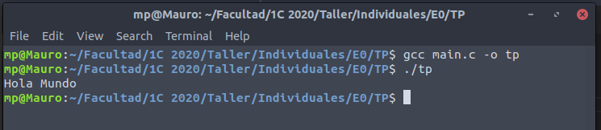

# Informe TP0

## Detalles administrativos

* **Materia:** Taller de Programación I
* **Año y cuatrimestre:** 1°C 2020
* **Alumno:** PARAFATI, Mauro
* **Padrón:** 102749
* [**Link al repositorio**](https://github.com/mauro7x/taller_tp0)

<!-- ##################################################################### -->

# Presentación del trabajo

## Descripción del problema

> Se requiere una aplicación de consola que cuente palabras y líneas de un archivo de texto plano determinado.

## Especificaciones requeridas por la cátedra

### De funcionalidad:

> El sistema debe recibir el archivo de texto por entrada estándar o como argumento de invocación por línea de comando.
>
> El proceso del archivo consiste en analizar su contenido contando las palabras como conjuntos de caracteres separados por cierto delimitador.
> 
> El total encontrado se debe imprimir por salida estándar.

### De formato:
```
La sintaxis de ejecución del aplicativo será la siguiente:

    ./tp [archivo]

El parámetro [​archivo​] es opcional e indica la ruta del archivo de texto a procesar. Su ausencia indica el uso de la entrada estándar.
```

### De códigos de retorno:
```
Se requieren los siguientes códigos de error:
    - 0 en caso de éxito,
    - 1 en caso de que el archivo especificado no exista o no se poseen permisos de lectura.
```

### De la entrada estándar y archivos de texto:
```
De ser requerido, el sistema leerá el contenido del archivo de entrada estándar. En cualquier caso, el formato del archivo de entrada se asume como texto plano con caracteres usuales.

Se considera una palabra a cualquier conjunto de caracteres que se encuentre delimitado por alguno de los siguientes elementos:
    - inicio de archivo,
    - fin de archivo,
    - caracteres delimitadores: espacio (‘ ‘), fin de línea (‘\n’), punto (‘.’), coma (‘,’), punto y coma (‘;’), dos puntos (‘:’).
```

### De la salida estándar:
```
Se espera el siguiente formato de salida estándar:

    <cantidad-palabras>\n
```

## Restricciones
```
La siguiente es una lista de restricciones técnicas exigidas para el sistema:

    1. El sistema debe desarrollarse en ISO C (C99).
    2. Está prohibido el uso de variables globales.
    3. Se requiere un correcto uso de Tipos de Datos Abstractos (TDA).
    4. Está prohibido el uso de funciones globales sin su correspondiente TDA salvo ‘ main​ ’.
    5. Se deben respetar el uso de buenas prácticas de programación.
```

<!-- ##################################################################### -->

# Resolución
Este trabajo se realizó siguiendo una serie de **pasos** provistos por la cátedra. Se procede a detallar el realizamiento de los mismos a continuación.

## PASO 0: Entorno de trabajo
```
Si bien SERCOM es capaz de compilar y someter a prueba las entregas del alumno, usarlo como entorno de trabajo remoto es lento e ineficiente.
Por eso es importante que el alumno invierta un tiempo en la configuración de un entorno de trabajo local que le será mucho más redituable y cómodo.
```

### Documentación requerida

```
a. Capturas de pantalla de la ejecución del aplicativo (con y sin Valgrind).
```
Se incluyen a continuación las capturas de pantallas pedidas:

* Ejecución del aplicativo sin Valgrind: 

* Ejecución del aplicativo con Valgrind: 

#
```
b. ¿Para qué sirve ​ Valgrind​? ¿Cuáles son sus opciones más comunes?
```
Valgrind es una herramienta que nos permite, entre otras cosas, verificar que nuestro código no tenga problemas con el **manejo de la memoria** dinámica, como pueden ser los llamados `memory leaks`, en los que nunca se libera la memoria reservada.

Si bien sé que Valgrind tiene otras opciones, como desconozco sus utilidades me limito a contestar sobre el uso que le dí en anteriores materias *(Algoritmos y Programación II)*.


#
```
c. ¿Qué representa ​ sizeof()​? ¿Cuál sería el valor de salida de sizeof(char)​ y ​sizeof(int)​?
```
`sizeof()` es una **función** provista por el lenguaje que nos proporciona información sobre la **cantidad de bytes** que ocupa una determinada variable o un determinado tipo de variable **en nuestra arquitectura**. Es muy útil para cuando queremos reservar memoria, ya que necesitamos saber cuántos bytes ocupan las variables que queremos alojar en la misma.

El valor de salida de `sizeof()` (en particular, de `sizeof(char)` y de `sizeof(int)`) **no es fijo** ya que siempre **depende** de la arquitectura en la que se está trabajando. En general, `sizeof(char)` devolvera `1` mientras que `sizeof(int)` devolvera `4`, pero repito, depende siempre de la arquitectura.
#
```
d. ¿El ​ sizeof()​ de una struct de C es igual a la suma del sizeof() ​de cada uno sus elementos?

Justifique mediante un ejemplo.
```
Como siempre, la respuesta es **depende** de la arquitectura en uso, pero en general, esto no se cumple ya que si bien un `char` puede ocupar `1 byte`, por cuestiones de **alineamiento** en la memoria (es conveniente tener las variables en memoria *alineadas* a n bytes, por lo general, a 4 o a 8, ya que facilita su acceso) terminan quedando bytes "desperdiciados".

Ejemplificamos a continuación:


#
```
e. Investigar la existencia de los archivos estándar: STDIN, STDOUT, STDERR.

Explicar brevemente su uso y cómo redirigirlos en caso de ser necesario (caracteres `>`​ y `​<`​) y como conectar la salida estándar de un proceso a la entrada estándar de otro con un pipe​ (carácter `|`).
```


