# Informe TP0

## Detalles administrativos

* **Materia:** Taller de Programación I
* **Año y cuatrimestre:** 1°C 2020
* **Alumno:** PARAFATI, Mauro
* **Padrón:** 102749
* [**Link al repositorio**](https://github.com/mauro7x/taller_tp0)

<!-- ##################################################################### -->

# Tabla de contenidos

1. [Presentación del trabajo](#presentacion)
    * [Descripción del problema](#descripcion)
    * [Especificaciones requeridas por la cátedra](#especificaciones)
    * [Restricciones](#reestricciones)
2. [Resolución](#resolucion)
    * [Paso 0: Entorno de trabajo](#r_paso0)
    * [Paso 1: SERCOM - Errores de generación y normas de programación](#r_paso1)
    * [Paso 2: SERCOM - Errores de generación 2](#r_paso2)
    * [Paso 3: SERCOM - Errores de generación 3](#r_paso3)
    * [Paso 4: SERCOM - Memory Leaks y ​ Buffer Overflows](#r_paso4)
    * [Paso 5: SERCOM - Código de retorno y salida estándar](#r_paso5)
    * [Paso 6: SERCOM - Entrega exitosa](#r_paso6)
    * [Paso 7: SERCOM - Revisión de la entrega](#r_paso7)

<!-- ##################################################################### -->

# Presentación del trabajo <a name="presentacion"></a>

## Descripción del problema <a name="descripcion"></a>

> Se requiere una aplicación de consola que cuente palabras y líneas de un archivo de texto plano determinado.

## Especificaciones requeridas por la cátedra <a name="especificaciones"></a>

### De funcionalidad:

> El sistema debe recibir el archivo de texto por entrada estándar o como argumento de invocación por línea de comando.
>
> El proceso del archivo consiste en analizar su contenido contando las palabras como conjuntos de caracteres separados por cierto delimitador.
> 
> El total encontrado se debe imprimir por salida estándar.

### De formato:

> La sintaxis de ejecución del aplicativo será la siguiente:
>
> `./tp [archivo]`
>
> El parámetro [​archivo​] es opcional e indica la ruta del archivo de texto a procesar. Su ausencia indica el uso de la entrada estándar.

### De códigos de retorno:

> Se requieren los siguientes códigos de error:
>    - 0 en caso de éxito,
>    - 1 en caso de que el archivo especificado no exista o no se poseen permisos de lectura.


### De la entrada estándar y archivos de texto:

> De ser requerido, el sistema leerá el contenido del archivo de entrada estándar. En cualquier caso, el formato del archivo de entrada se asume como texto plano con caracteres usuales.
> 
> Se considera una palabra a cualquier conjunto de caracteres que se encuentre delimitado por alguno de los siguientes elementos:
>    - inicio de archivo,
>    - fin de archivo,
>    - caracteres delimitadores: espacio (‘ ‘), fin de línea (‘\n’), punto (‘.’), coma (‘,’), punto y coma (‘;’), dos puntos (‘:’).


### De la salida estándar:

> Se espera el siguiente formato de salida estándar:
> 
> `<cantidad-palabras>\n`


## Restricciones <a name="reestricciones"></a>

> La siguiente es una lista de restricciones técnicas exigidas para el sistema:
> 1. El sistema debe desarrollarse en ISO C (C99).
> 2. Está prohibido el uso de variables globales.
> 3. Se requiere un correcto uso de Tipos de Datos Abstractos (TDA).
> 4. Está prohibido el uso de funciones globales sin su correspondiente TDA salvo ‘ main​ ’.
> 5. Se deben respetar el uso de buenas prácticas de programación.


<!-- ##################################################################### -->

# Resolución <a name="resolucion"></a>
Este trabajo se realizó siguiendo una serie de **pasos** provistos por la cátedra. Se procede a detallar el realizamiento de los mismos a continuación.

## PASO 0: Entorno de trabajo <a name="r_paso0"></a>

> Si bien SERCOM es capaz de compilar y someter a prueba las entregas del alumno, usarlo como entorno de trabajo remoto es lento e ineficiente.
> Por eso es importante que el alumno invierta un tiempo en la configuración de un entorno de trabajo local que le será mucho más redituable y cómodo.


### Documentación requerida

> **a.** Capturas de pantalla de la ejecución del aplicativo (con y sin Valgrind).

Se incluyen a continuación las capturas de pantallas pedidas:

1. Ejecución del aplicativo sin Valgrind: 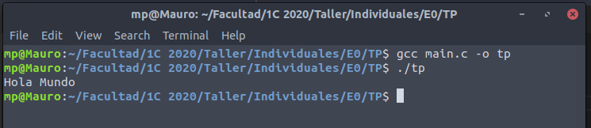

2. Ejecución del aplicativo con Valgrind: 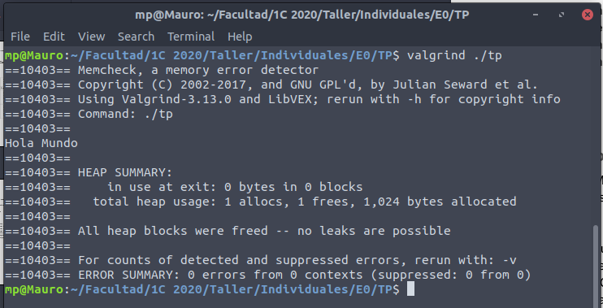

<hr>

> **b.** ¿Para qué sirve ​ Valgrind​? ¿Cuáles son sus opciones más comunes?

Valgrind es una herramienta que nos permite, entre otras cosas, verificar que nuestro código no tenga problemas con el **manejo de la memoria** dinámica, como pueden ser los llamados `memory leaks`, en los que nunca se libera la memoria reservada.

Si bien sé que Valgrind tiene otras opciones, como desconozco sus utilidades me limito a contestar sobre el uso que le dí en anteriores materias *(Algoritmos y Programación II)*.

<hr>

> **c.** ¿Qué representa ​ sizeof()​? ¿Cuál sería el valor de salida de sizeof(char)​ y ​sizeof(int)​?

`sizeof()` es una **función** provista por el lenguaje que nos proporciona información sobre la **cantidad de bytes** que ocupa una determinada variable o un determinado tipo de variable **en nuestra arquitectura**. Es muy útil para cuando queremos reservar memoria, ya que necesitamos saber cuántos bytes ocupan las variables que queremos alojar en la misma.

El valor de salida de `sizeof()` (en particular, de `sizeof(char)` y de `sizeof(int)`) **no es fijo** ya que siempre **depende** de la arquitectura en la que se está trabajando. En general, `sizeof(char)` devolvera `1` mientras que `sizeof(int)` devolvera `4`, pero repito, depende siempre de la arquitectura.

<hr>

> **d.** ¿El ​ sizeof()​ de una struct de C es igual a la suma del sizeof() ​de cada uno sus elementos?
>
> Justifique mediante un ejemplo.

Como siempre, la respuesta es **depende** de la arquitectura en uso, pero en general, esto no se cumple ya que si bien un `char` puede ocupar `1 byte`, por cuestiones de **alineamiento** en la memoria (es conveniente tener las variables en memoria *alineadas* a n bytes, por lo general, a 4 o a 8, ya que facilita su acceso) terminan quedando bytes "desperdiciados".

Para ejemplificar, definamos el siguiente struct:
```
[In: 1]     typedef struct {
                char a;
                int b;
            } ejemplo;
```
Como vemos, suponiendo que la salida de `sizeof(char)` sea 1 y que la de `sizeof(int)` sea 4, la suma de los `sizeof()` de los respectivos componentes de la estructura, sería 5.

Sin embargo, si corremos `sizeof(ejemplo)`, el resultado no será 5, sino 8, que corresponde a 1 byte del char `a`, 3 bytes "desperdiciados" por la alineación a 4 bytes, y 4 bytes del int `b`.
```
[In: 2]     sizeof(char)
[Out: 2]    1

[In: 3]     sizeof(int)
[Out: 3]    4

[In: 4]     sizeof(ejemplo)
[Out: 4]    8
```

<hr>

> **e.** Investigar la existencia de los archivos estándar: STDIN, STDOUT, STDERR.
> 
> Explicar brevemente su uso y cómo redirigirlos en caso de ser necesario (caracteres `>`​ y `​<`​) y como conectar la salida estándar de un proceso a la entrada estándar de otro con un pipe​ (carácter `|`).

`STDIN`, `STDOUT`, y `STDERR` son **canales** de streams de datos, respectivamente, de **entrada**, de **salida**, y de **error**. 
* El prefijo `STD` representa `STANDARD`, por lo que `STDIN` significa `Standard Input`. Por este canal, se envian datos al programa (canal de entrada).
* `STDOUT` significa `Standard Output`, canal por el cual el programa envía datos (canal de salida).
* `STDERR` significa `Standard Error`, canal por el cual se envían los mensajes de error en caso de existir. 

Estos canales pueden ser **redirigidos** utilizando ciertos caracteres especiales que se detallan a continuación:
* `[ < ]:` La utilización de este caracter permite **redirigir la entrada estandar** (*stdin*) de nuestro programa. Ejemplificamos:
    * Ejecutando nuestro programa corriendo `./tp`, si queremos leer algo de *stdin*, por defecto leemos de la consola (teclado).
    * Si en cambio queremos leer de un archivo de texto, por ejemplo, podemos correr `./tp < archivo.txt`, lo que establece a `archivo.txt ` como entrada estandar de datos de nuestro programa. Es decir que cada vez que leamos de stdin, estamos leyendo de `archivo.txt`.
* `[ > ]:` Funciona de la misma manera que `[ < ]`, sólo que se redirige la salida del programa. Por ejemplo:
    * Si corremos `./tp` y en nuestro código enviamos un mensaje por **stdout**, por defecto se imprimirá en la consola (pues es el canal de salida por defecto, *stdout*).
    * Si en cambio corremos `./tp > archivo.txt`, el mismo código esta vez escribira el contenido en el archivo de texto `archivo.txt`.
* `[ | ]:` Permite conectar la salida de un proceso con la entrada de otro. Por ejemplo: supongamos que tenemos dos archivos de texto `file1.txt`, y `file2.txt` que queremos utilizar como **stdin** para nuestro programa. Lo que podemos hacer es ejecutar: `cat file1.txt file2.txt | ./tp`. Analicemos por partes esta instrucción:
    1. Vemos que tenemos dos procesos, por un lado `cat file1.txt file2.txt` y por otro `./tp`.
    2. La salida del primer proceso, que sera la concatenación de los archivos `file1.txt` y `file2.txt`, será redirigida a la entrada de `./tp` por medio del caracter `[ | ]`.
    3. Ahora, la concatenación de ambos archivos de texto es la entrada estandar de nuestro programa.

<hr>

## PASO 1: SERCOM - Errores de generación y normas de programación <a name="r_paso1"></a>

> Entregar el código fuente identificado para el paso actual subiendo un archivo .ZIP al SERCOM.
>
> Analizar el resultado de la ejecución del mismo. Observar que la entrega falló, debido a que SERCOM no pudo generar la aplicación correctamente y fallaron las normas de verificación de código.

### Documentación requerida

> **a.** Captura de pantalla mostrando los problemas de estilo detectados. Explicar cada uno.

Se adjunta la captura pedida, donde se muestra el **stderr** generado por los errores en la verificación de las **normas de codificación**:

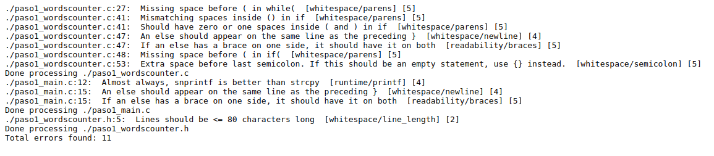

Procedo a explicar cada uno de ellos: <a name="errores_estilo"></a>

1. El primero nos dice que falta agregar un `whitespace` antes de la condición de un `while` (escribir `while (...)` en vez de `while(...)`).

2. Este segundo error se debe a que la cantidad de espacios dentro del `if` no coincide con el estándar. 

3. Ahora nos informa que hay `whitespaces` de más dentro de la condición del `if` (escribir `if (a > b)` en vez de `if ( ___ a > b)`).

4. Se genera ya que el `else if` debe escribirse en la misma linea que el anterior `}`.

5. Explica que si un `else` tiene una llave de un lado, la debería tener en ambos (debería ser `} else if {`).

6. Idem error **1.**

7. Nos informa que hay un `whitespace` extra antes de `;`.

8. Nos dice que usemos `snprintf` en vez de `strcpy`.

9. Idem error **4.**

10. Idem error **5.**

11. Se debe a que la longitud de la línea es mayor a 80 (límite).

<hr>

> **b.** Captura de pantalla indicando los errores de generación del ejecutable. Explicar cada uno e indicar si se trata de errores del compilador o del linker.

Se adjunta la captura pedida, donde se muestra el **stderr** generado por los errores en la **compilación** y generación del ejecutable:

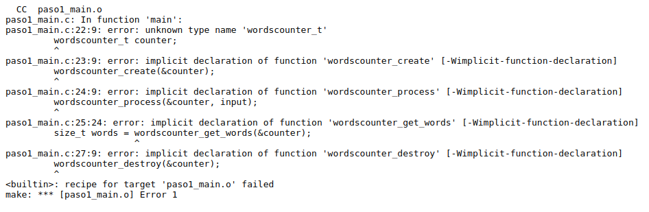

Procedo a explicar cada uno de ellos:

1. El primer error está en la linea 22, donde se utiliza `wordscounter_t` como un tipo de dato sin antes definirlo. Se trata de un **error de compilación**, pues el compilador necesita saber qué tipo de variable es para poder reservar la memoria para la misma, y para esto es necesaria su previa **definición** (no alcanza con declararla).

2. El segundo error se encuentra en la linea 23 y se debe a que en `paso1_main.c` se utiliza una supuesta función `wordscounter_create` **sin antes declararla**. El problema con esto es que el compilador **necesita conocer la firma** de la función para poder realizar las verificaciones pertinentes en cuanto a los parámetros que se pasan, y al tipo de dato que se espera en el retorno.
En cuanto a si se trata de un error de compilación o de linkeo, este caso es más delicado: normalmente, la declaración implícita de funciones arroja un *warning* en etapa de compilación, ya que este problema puede ser resuelto en etapa de linkeo. Seguramente, lo que está sucediendo es que se compila utilizando el flag `-Werror` que convierte los *warnings* en *errores*. Por esto es que se puede decir que es un **error de compilación.**

3. Idem **2.**, pero con la función `wordscounter_process`.

4. Idem **2.**, pero con la función `wordscounter_get_words`.

5. Idem **2.**, pero con la función `wordscounter_destroy`.

<hr>

> **c.** ¿El sistema reportó algún WARNING? ¿Por qué?

No, el sistema **no reportó warnings**, y esto se debe a que se utilizó el flag `-Werror` para compilar con gcc. Este flag convierte todos los warnings en errores *(asumo que se utilizó este flag puesto que `-Wimplicit-function-declaration` siempre es un **warning**)*.

<hr>

## PASO 2: SERCOM - Errores de generación 2 <a name="r_paso2"></a>

> Volver a realizar una nueva entrega.
> Verificar los cambios realizados respecto de la entrega anterior utilizando el comando diff:
>
> ```
> diff paso1_main.c paso2_main.c || diff paso1_wordscounter.c paso2_wordscounter.c || diff paso1_wordscounter.h paso2_wordscounter.h
> ```
>
> Observar que el chequeo de normas de codificación es exitoso pero aún no fue posible generar un ejecutable.

### Documentación requerida

> **a.** Describa ​ en breves palabras​ las correcciones realizadas respecto de la versión anterior.

Por un lado, los cambios realizados apuntaron a corregir los **errores de estilo** detallados en el paso anterior. Es decir, se eliminaron `whitespaces` innecesarios, se agregaron otros que hacían falta, etc. Se puede ver la lista de los errores que fueron arreglados [aquí](#errores_estilo).

Por otro lado, también se arregló el error de **funciones declaradas de forma implícita** en el `paso1_main.c`, puesto que se incluyó el header con la linea `#include "paso2_wordscounter.h"` donde se declara las funciones y estructuras utilizadas.

<hr>

> **b.** Captura de pantalla indicando la correcta ejecución de verificación de normas de
programación.

Se adjunta la captura pedida, donde se puede observar que la verificación de las normas de programación fueron ejecutadas correctamente:

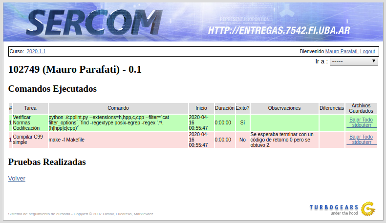

<hr>

> **c.** Captura de pantalla indicando los errores de generación del ejecutable. Explicar cada uno e indicar si se trata de errores del compilador o del linker.

Se adjunta la captura pedida, donde se muestra el **stderr** generado por los errores en la **compilación** y **generación del ejecutable**:

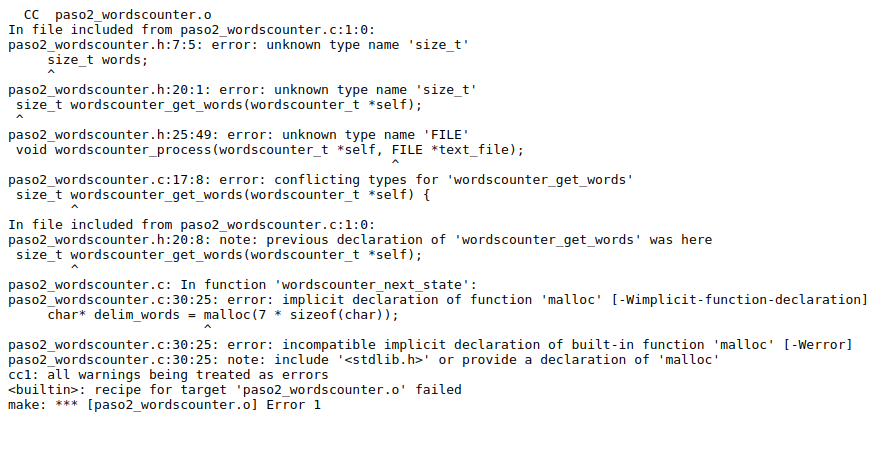

Breve explicación de los mismos:

1. El primer error está en la linea 7 del header `paso2_wordscounter.h`, donde se utiliza el tipo de dato `size_t` sin incluir la librería que lo define. Es un **error de compilación** pues el compilador necesita conocer el tamaño en bytes del tipo de dato utilizado para reservar la memoria.

2. En la linea 20 del mismo header, se repite el error del punto **1.**

3. En la linea 25, se vuelve a repetir el mismo error, pero con el tipo de dato `FILE`.

4. En la linea 17 del archivo `paso2_wordscounter.c`, nos lanza un error de **conflicto de tipos de datos**, debido a que en la declaración del mismo en el header, tenemos el problema descripto en el item **2.** Se trata también de un **error de compilación**, pues arrastramos el error anterior.

5. En la linea 20 del header, tenemos una nota que nos informa de una **declaración previa** de la función con la que tuvimos conflicto en el item anterior: `wordscounter_get_words(...)`, y esto se debe a que al no reconocer el tipo de dato, no la reconoce y cree que la estamos re-declarando. No se trata de un error en si, el problema es el descripto en el item **4.**

6. En la linea 30 del archivo c, nuevamente tenemos un problema de **definición implícita**, en este caso de la función `malloc`. Se trata de un warning en compilación, y de un **error** en linkeo, pero como se utiliza el flag `-Werror`, se levanta el error en etapa de compilación.

7. Otro error generado por la declaración implícita detallada en el item **6.**: nos informa que hay una incompatibilidad entre la función implícita y la función `built-in` de GCC. Tengo entendido que esto se debe a que cuando declaramos de forma implícita una función en C, el tipo de retorno se establece como `int`, mientras que en la función `built-in` de GCC, el tipo de retorno será otro. Nuevamente, error de compilación.

8. Nota en la que GCC nos pide incluir `<stdlib.h>` para incluir la declaración de `malloc` o declararla. No se trata de un error.

<hr>

## PASO 3: SERCOM - Errores de generación 3 <a name="r_paso3"></a>

> Volver a realizar una nueva entrega.
> Verificar los cambios realizados respecto de la entrega anterior utilizando el comando diff:
>
> ```
> diff paso2_main.c paso3_main.c || diff paso2_wordscounter.c paso3_wordscounter.c || diff paso2_wordscounter.h paso3_wordscounter.h
> ```
>
> Observar que el chequeo de normas de codificación es exitoso pero aún no fue posible generar un ejecutable.

### Documentación requerida

> **a.** Describa ​en breves palabras​ las correcciones realizadas respecto de la versión anterior.

Se realizaron tres simples cambios que probablemente hayan corregido la mayoría de los errores que tuvimos en el último paso: se incluyó la librería `<stdlib.h>` en `paso2_wordscounter.c` y se incluyeron las librerías `<string.h>` y `<stdio.h>` en `paso2_wordcounter.h`.

Con estas inclusiones, se deberían solucionar todos los problemas de tipos desconocidos que tuvimos con `size_t` y los de declaración implícita que tuvimos con `malloc`.

<hr>

> **b.** Captura de pantalla indicando los errores de generación del ejecutable. Explicar cada uno e indicar si se trata de errores del compilador o del linker.

Se adjunta la captura pedida, donde se muestra el **stderr** generado por los errores en la **compilación** y **generación del ejecutable**:

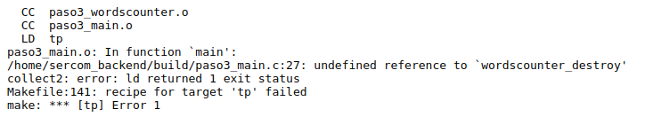

Como vemos, nos queda sólo un error, aunque esta vez hay una gran diferencia. Se ha logrado terminar la etapa de **compilación** tanto para `paso3_wordscounter.o` como para `paso3_main.o`. El problema ahora está en el **linker**, y el mismo se debe a que se ha declarado una función llamada `wordscounter_destroy` en el header, se la ha utilizado en el main, pero nunca se la ha definido. En este caso decimos que es un problema del **linker** ya que el compilador **puede** realizar su trabajo con la **declaración** de la función (esta le provee de toda la información que necesita: tipos de datos de retorno, y de parámetros, con los cuáles puede realizar las verificaciones pertinentes).

Al compilador no le preocupa entonces no tener la definición, pues es tarea del **linker** completar la referencia.

<hr>


## PASO 4: SERCOM - Memory Leaks y ​ Buffer Overflows <a name="r_paso4"></a>

> Volver a realizar una nueva entrega.
> Verificar los cambios realizados respecto de la entrega anterior utilizando el comando diff:
>
> ```
> diff paso3_main.c paso4_main.c || diff paso3_wordscounter.c paso4_wordscounter.c || diff paso3_wordscounter.h paso4_wordscounter.h
> ```
>
> Observar que el archivo ejecutable se generó exitosamente y se ejecutaron los casos de prueba.
>
> Observar que las pruebas ‘TDA’, ‘C Language’ y ‘STDIN’ corrieron exitosamente aunque fallaron al ejecutar con Valgrind.
>
> Observar que las pruebas ‘Invalid File’, ‘Long Filename’ y ‘Single Word’ no lograron correr exitosamente.

### Documentación requerida

> **a.** Describa en breves palabras las correcciones realizadas respecto de la versión anterior.

La única corrección realizada fue que se definió la función `wordscounter_destroy` en `paso4_wordscounter.c`, lo que permite armar el ejecutable sin problemas pues soluciona el problema de linkeo que teníamos en el paso anterior.

<hr>

> **b.** Captura de pantalla del resultado de ejecución con Valgrind​ de la prueba `TDA`. Describir los errores reportados por Valgrind.

Se adjunta la captura pedida, donde se muestra la salida de Valgrind (**valgrind.out**) en la prueba `TDA`:

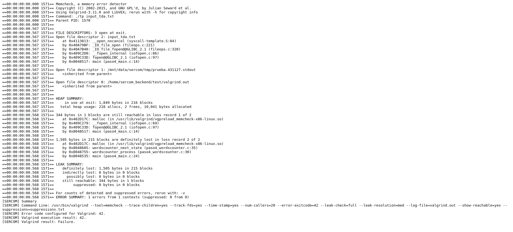

Vemos que se establece el código de error para Valgrind en `42`, y que el resultado de la ejecución con Valgrind fue justamente `42`, lo que significa que la prueba falla. Veamos en mas detalle los errores.

Valgrind reporta los siguientes `leaks` de memoria:

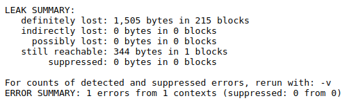

Como podemos ver, nos informa que tras la ejecución de nuestro código hubieron `leaks de memoria`, lo que significa que se reservó memoria que nunca se libreró. Específicamente, nos informa que se perdieron **1505 bytes**, y los mismos no seran recuperados hasta que el S.O. forzosamente los recupere, o en su defecto hasta que se reinicie el sistema.

Además, en otro error, nos informa que al finalizar la ejecución no se cerró el archivo `input_tda.txt`:

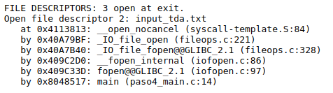


<hr>

> **c.** Captura de pantalla del resultado de ejecución con Valgrind​ de la prueba `Long Filename`. Describir los errores reportados por Valgrind.

Se adjunta la captura pedida, donde se muestra la salida de Valgrind (**valgrind.out**) en la prueba `Long Filename`:

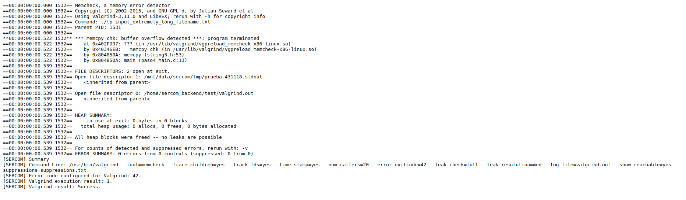

En este caso vemos que Valgrind no reporta errores de `memory leaks`, sino que reporta **errores en la ejecución del programa**:


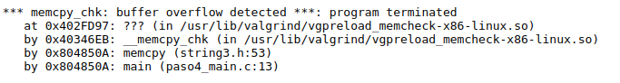

Vemos que nos informa sobre un **buffer overflow** que terminó la ejecución del programa. Nos informa que el mismo se generó por la utilización de la función `memcopy` en `paso4_main.c`. Este error se generó debido a que `memcpy` copia desde `src` en `dest` la cantidad de caracteres `n` que se le indique. El problema está en que nuestro **buffer** (*`dest`*) tiene memoria finita reservada para su almacenamiento, por lo que si no tenemos reestricciones para `n`, se genera este **overflow**.


<hr>

> **d.** ¿Podría solucionarse este error utilizando la función `strncpy​`? ¿Qué hubiera ocurrido con la ejecución de la prueba?

No, no se solucionaría el error utilizando la función `strncpy`. Según tengo entendido, la diferencia entre ambas funciones es simplemente que `memcpy` copia hasta los `n` caracteres indicados, mientras que `strncpy` se detiene si encuentra un símbolo de terminación de string. 

En este caso, como explicamos antes, el error se genera porque nuestro **input** tiene más de 30 caracteres, por lo que no entran en el **buffer destino** generando un overflow del mismo en la memoria.

La prueba **fallaría** de igual manera, por un overflow del buffer.

<hr>

> **e.** Explicar de qué se trata un `segmentation fault​` y un `buffer overflow​`.

**Buffer overflow**: como su nombre lo indica, ocurre cuando "desbordamos" un buffer, es decir, cuando cometemos el error de *copiar una cantidad de datos sobre una variable que **no tiene el espacio en memoria reservado que es necesario** para almacenar tal cantidad. Por ejemplo, en el caso de nuestro buffer `filepath`: el mismo tiene capacidad para almacenar hasta **30 chars**, por lo que si intentamos ingresar un archivo cuya ruta supere los 30 chars, generaremos este overflow.

**Segmentation fault**: este error es más comun, se genera cuando queremos acceder a **zonas de memoria no permitidas**, y puede suceder por diversas causas. Por ejemplo, puede suceder cuando queremos acceder a una posición de un *array* que no pertenece al mismo, como podría ser en el siguiente ejemplo:

```
int ejemplo[10]; // nuestro array se indexa desde 0 ... 9
ejemplo[10] = 34; // cometemos un error indexando
```
O también se puede pensar en el ejemplo de nuestro trabajo práctico, ya que los *buffer overflows* **implican** *segmentation faults*. De acuerdo con lo explicado, en un buffer overflow estamos intentando escribir sobre memoria que no corresponde al buffer en sí, es decir estamos comentiendo un **segmentation fault**.

<hr>

## PASO 5: SERCOM - Código de retorno y salida estándar <a name="r_paso5"></a>

> Volver a realizar una nueva entrega.
> Verificar los cambios realizados respecto de la entrega anterior utilizando el comando diff:
>
> ```
> diff paso4_main.c paso5_main.c || diff paso4_wordscounter.c paso5_wordscounter.c || diff paso4_wordscounter.h paso5_wordscounter.h
> ```
>
> Observar que las pruebas ‘TDA’, ‘C Language’, ‘STDIN’ y ‘Long Filename’ corrieron exitosamente sin fallas de Valgrind.
>
> Observar que las pruebas ‘Invalid File’ y ‘Single Word’ no lograron correr exitosamente.
>
> Ubique en el SERCOM el caso de prueba​ ‘Single Word’, descargue y descomprima sus archivos de entrada.
>
> Ubique en el SERCOM la tarea fuente​ ‘Compilar C99 Simple’, descargue y descomprima sus archivos de entrada.
>
> Asegúrese que todos los archivos de código fuente, el archivo ‘input_single_word.txt’ y el archivo Makefile se encuentran ​ en el mismo directorio.
>
> Ejecute el comando `hexdump` para examinar el contenido del archivo ‘input_single_word.txt’ en modo binario.
> ```
> hd input_single_word.txt
> o
> hexdump -C input_single_word.txt
> ```
> 
> Coloque el archivo ‘input_single_word.txt’ junto con todos los archivos de código fuente. Compile el código​ utilizando el comando `make`.
>
> Ejecute el comando `gdb` para examinar el depurar la ejecución del programa:
> ```
> gdb ./tp
> info functions
> list wordscounter_next_state
> list
> break 45
> run input_single_word.txt
>>quit
> ```

### Documentación requerida

> **a.** Describa en breves palabras las correcciones realizadas respecto de la versión anterior.

Esta vez se realizaron varias correcciones, las cuales detallare de forma breve por cada archivo:
- `paso5_main.c`: para setear el input desde un archivo en caso de que se brinde uno por los argumentos, no se copia el *filepath* a otra variable, si no que se usa directamente `argv[1]` para abrirlo. Evita el posible **buffer overflow** que vimos en el paso anterior.
- `paso5_wordscounter.c`: en vez de reservar memoria dinámica con `malloc` para los siete caracteres delimitadores cada vez que se invoque a la función `wordscounter_next_state`, se los agrupa todos en una misma variable de tipo `const char*`. Esto resolverá el problema de los leaks en memoria. 


<hr>

> **b.** Describa el motivo por el que fallan las prueba ‘Invalid File’ y ‘Single Word’. ¿Qué información entrega SERCOM para identificar el error? Realice una captura de pantalla.

Inicialmente, cuando entramos a la entrega realizada, podemos ver en la sección `Corrida` las pruebas que fallaron en rojo, donde *SERCOM* nos da información sobre **qué prueba fallo**, **en qué tarea**, nos hace **observaciones**, en algunos casos nos muestra las **diferencias** entre lo esperado y lo obtenido, y finalmente nos proporciona los **archivos de salida** con el detalle de los fallos. *Adjunto capturas a continuación donde se observa esto:*

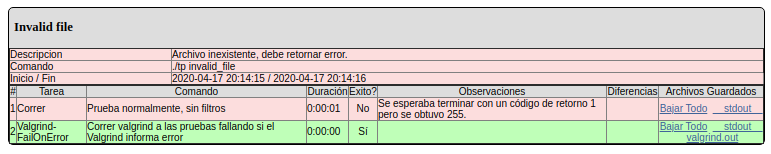
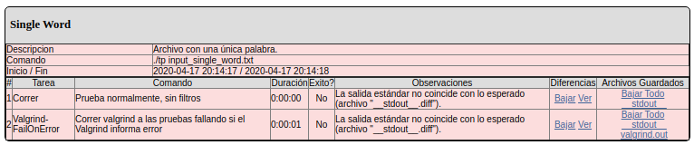

A continuación, utilizando esta información que SERCOM nos proporciona, analizamos por qué fallo cada una de ellas.

- **`Invalid File`**: vemos en las observaciones que la tarea `1| Correr | Prueba normalmente, sin filtros` falla debido a que:
> "Se esperaba terminar con un código de retorno 1 pero se obtuvo 255."

Tras correr el mismo en `local`, observo que efectivamente que el programa no reporta ningún error. *Adjunto captura:*

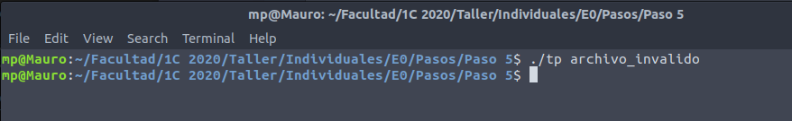


- **`Single Word`**: vemos que en este caso, la prueba falla ya que ninguna de sus dos tareas se logran realizar. Analizamos la falla de cada una de ellas:
    - `1| Correr`: vemos que según las observaciones, no coincide la salida con lo esperado. Entrando en el apartado `Diferencias`, podemos ver que se esperaba un `1` mientras que la salida retornó `0`. *Adjunto captura:*

    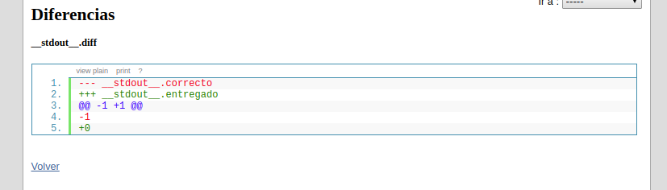

    - `2| Valgrind-FailOnError`: falla por exactamente la misma razón. Se esperaba un `1` y se obtuvo un `0`.

<hr>

> **c.** Captura de pantalla de la ejecución del comando `hexdump`.
> ¿Cuál es el último carácter del archivo `input_single_word.txt`?

Adjunto la captura pedida del comando `hexdump` a continuación:

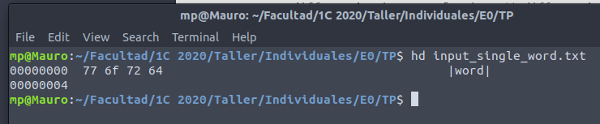

Vemos que el último carácter del archivo es la `d` de `word`. Podemos ver esto ya que como vemos, luedo de la palabra, en el último renglón, nos especifíca la dirección del último carácter del archivo, `00000004` *(que en este caso corresponde a `d`).*

Para que detecte la palabra, nuestro programa necesita que en el archivo se agregue el carácter `0a` al final del mismo ya sea por la inserción de un salto de linea, o de un espacio, etc. *(adjunto captura que muestra como debería verse el caracter para el programa en su estado actual detecte la palabra):*

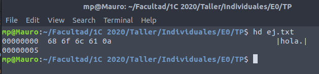

Al no contar con este carácter, nuestro programa **no detectará la palabra**, y retornara **0** cuando debía retornar **1**.

<hr>

> **d.** Captura de pantalla con el resultado de la ejecución con `gdb`.
> Explique brevemente los comandos utilizados en `gdb`.
> ¿Por qué motivo el debugger no se detuvo en el breakpoint de la línea 45: `self->words++;`?

Explicación breve de los comandos utilizados en `gdb`:

- **`info functions`**: muestra las funciones definidas en cada archivo, con sus correspondientes TDA de retorno, y sus parámetros (nos muestra la *declaración* de las funciones).

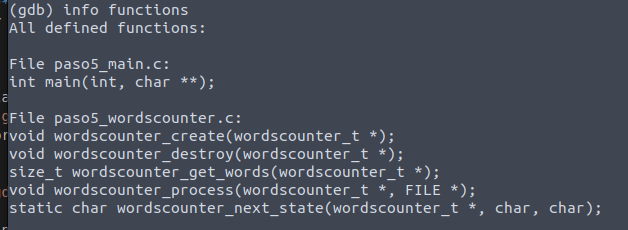

- **`list wordscounter_next_state`**: muestra 10 lineas alrededor de la función que se pasa como argumento.

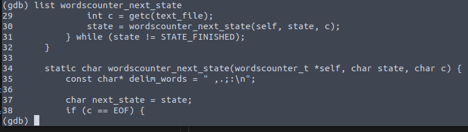

- **`list`**: muestra 10 lineas, partiendo de las últimas lineas que mostró en un uso anterior de list.

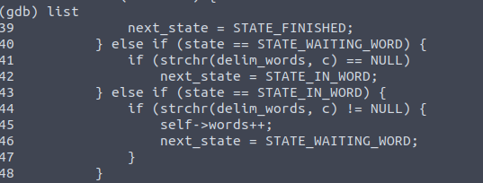

- **`break 45`**: establece un *breakpoint* en una linea, donde el programa dentendrá su ejecución al llegar allí. Es una poderosa **herramienta** de debugging pues permite estudiar las variables y su comportamiento en **determinados momentos** del programa.

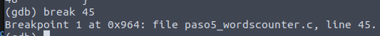

- **`run input_single_word.txt`**: inicia la ejecución del programa, pasandole el archivo como argumento.

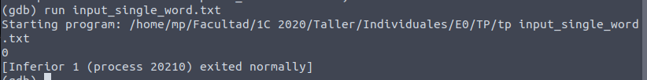

- **`quit`**: termina la ejecución de **gdb**.

**`gdb`** no se detuvo en la linea 45 ya que el archivo de entrada utilizado `input_single_word.txt` no contiene ningún carácter definido como delimitador. Es por esto que no reconoce la palabra.

<hr>

## PASO 6: SERCOM - Entrega exitosa <a name="r_paso6"></a>

> Volver a realizar una nueva entrega.
> Verificar los cambios realizados respecto de la entrega anterior utilizando el comando diff:
>
> ```
> diff paso5_main.c paso6_main.c || diff paso5_wordscounter.c paso6_wordscounter.c || diff paso5_wordscounter.h paso6_wordscounter.h
> ```
>
> Observar que todas las pruebas fueron exitosas.
>
> Compilar el código y ejecutar localmente la prueba ‘Single Word’ utilizando distintas variantes:
> ```
> make
> ./tp input_single_word.txt
> ./tp <input_single_word.txt
> ./tp <input_single_word.txt >output_single_word.txt
> ```

### Documentación requerida

> **a.** Describa en breves palabras las correcciones realizadas respecto de la versión anterior.

Nuevamente, describo las correcciones realizadas por archivo:
- `paso6_main.c`: se re-define la constante `ERROR` con el valor `1` en vez de `-1`.
- `paso6_wordscounter.c`: primero, se definen los caracteres delimitadores como una constante. También se modifica la función `words_next_state` para que ahora si estamos en medio de una palabra y llega el *end of file* sin antes reconocer un carácter delimitador, se cuente la palabra.

<hr>

> **b.** Captura de pantalla mostrando todas las entregas realizadas​, tanto exitosas como fallidas.

Se adjunta la captura pedida, donde se ven las 6 entregas realizadas, siendo la última la **exitosa** (*paso 6*):

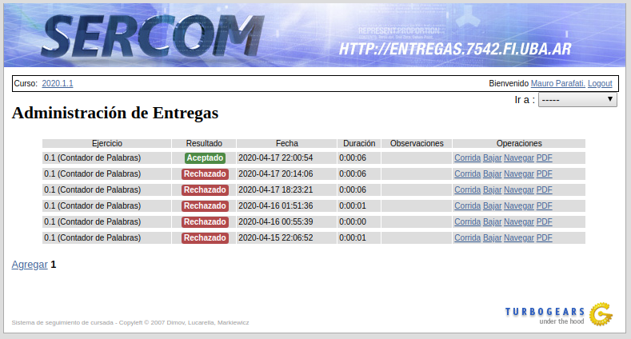

<hr>

> **c.** Captura de pantalla mostrando la ejecución de la prueba ‘Single Word’ de forma local​ con las distintas variantes indicadas.

Se adjunta la captura pedida:

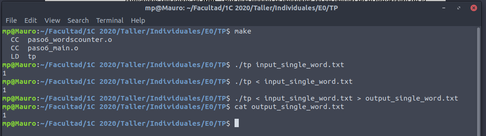

<hr>

## PASO 7: SERCOM - Revisión de la entrega <a name="r_paso7"></a>

> Revisar el estado de todas las pruebas ejecutadas en SERCOM con el código del paso 6.
>
> Abrir cada una de las salidas de Valgrind​ y controlar que no hay errores reportados que no fueran detectados como un fallo en la ejecución. Revisar con atención el listado de archivos abiertos al finalizar el programa.
>
> Controlar el código final entregado. Verificar el uso de buenas prácticas de programación y el cumplimiento del enunciado del trabajo.


